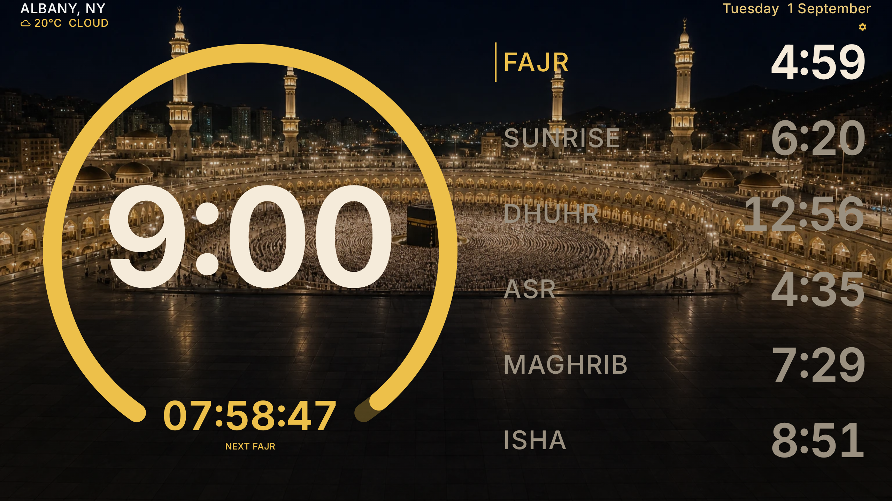
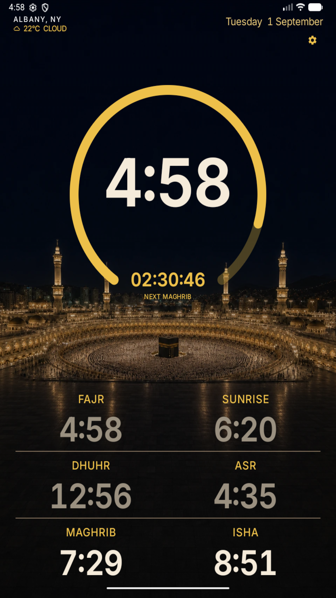
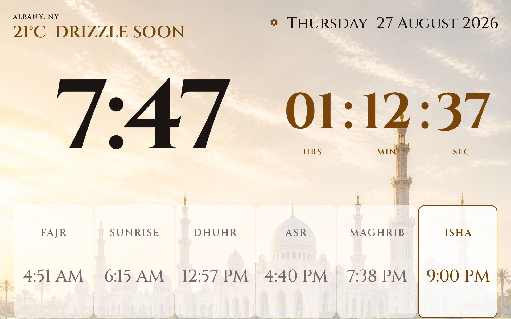

<div align="center">


# PrayerAthan

**A dedicated, full-screen wall clock and prayer time display for Android tablets.**

[](LICENSE)
[-blue.svg)](https://developer.android.com)
[](https://kotlinlang.org)
[](https://developer.android.com/jetpack/compose)

</div>

---

## Overview

Most prayer apps are built for phones: small fonts, endless menus, widgets that sleep, and complex setups. 

PrayerAthan is designed specifically for wall-mounted 7-inch and 10-inch Android tablets. It serves as an always-on ambient display with clean typography readable from 8 to 12 feet away.

<div align="center">
  <table>
    <tr>
      <td align="center"><b>Landscape Wall View (Dark)</b></td>
      <td align="center"><b>Portrait Wall View (Dark)</b></td>
    </tr>
    <tr>
      <td></td>
      <td></td>
    </tr>
  </table>
</div>

---

## Highlights

- **Readable across the room:** Big clock, live countdown to the next prayer (`HH:MM:SS`), and today's timetable.
- **Landscape and portrait:** Custom layouts designed natively for both orientations without awkward scaling.
- **Offline prayer calculation:** Uses [`adhan-kotlin`](https://github.com/batoulapps/adhan-kotlin) (ISNA / Shafi default) directly on the device. No internet connection required for prayer times.
- **Authentic athan audio:** Automatically plays Makkah athan at prayer times (with the distinct Fajr recording). Includes tap-to-stop and reliable alarms via `AlarmManager.setAlarmClock`.
- **Hourly daytime athkar:** Optional audio dhikr played on the hour between 8:00 AM and 9:00 PM (only between Fajr and Isha).
- **Day and night themes:** Warm plaster Light mode, night mosque Dark mode, or Auto mode that switches automatically at sunrise and sunset.
- **Always awake:** Uses `FLAG_KEEP_SCREEN_ON` to keep the screen active while mounted on the wall.
- **Offline city catalog:** Built-in searchable database of thousands of worldwide cities with coordinates and time zones, plus optional one-tap GPS fix.
- **Ambient weather:** Optional real-time temperature and sky condition display with short-range precipitation indicators.
- **Privacy focused:** No accounts, no ads, no trackers, and no external backend.

<div align="center">
  <table>
    <tr>
      <td align="center"><b>Adhan Playing State</b></td>
      <td align="center"><b>Light Plaster Theme</b></td>
    </tr>
    <tr>
      <td></td>
      <td></td>
    </tr>
  </table>
</div>

---

## Architecture & Codebase

The project is structured as a clean, single-module Android app:

```
PrayerAthan/
├── app/src/main/java/com/mutazyounes/prayerathan/
│   ├── MainActivity.kt        # Main entry point with sensor orientation & keep-awake
│   ├── engine/                # Pure Kotlin prayer math & offline location stores
│   │   ├── PrayerCalculator.kt
│   │   ├── PrayerDay.kt
│   │   └── CityCatalog.kt
│   ├── audio/                 # AlarmManager scheduling, foreground service & MediaPlayer
│   │   ├── AthanScheduler.kt
│   │   ├── AthanPlayer.kt
│   │   └── AthkarScheduler.kt
│   ├── ui/                    # Jetpack Compose wall screen, themes & settings sheet
│   │   ├── WallScreen.kt
│   │   ├── StackedClockWall.kt
│   │   ├── WallTheme.kt
│   │   └── SettingsSheet.kt
│   └── weather/               # Lightweight weather client for ambient header info
└── app/src/main/res/raw/      # Athan & athkar audio files
```

---

## Getting Started

### Prerequisites

- Android Studio Ladybug / Meerkat or later
- JDK 17 or higher
- Android SDK 36 (targetSdk) / Minimum Android 8.0 (API 26)

### Build and Run

1. Clone the repository:
   ```bash
   git clone https://github.com/AlmutazYounes/PrayerAthan.git
   cd PrayerAthan
   ```

2. Build the debug APK:
   ```bash
   ./gradlew assembleDebug
   ```

3. Run unit tests:
   ```bash
   ./gradlew test
   ```

4. Install to a connected tablet or emulator:
   ```bash
   ./gradlew installDebug
   ```

---

## License

Code is distributed under the [MIT License](LICENSE).
