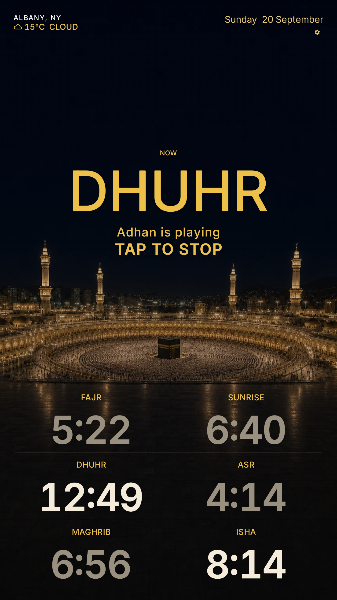

<div align="center">


# Athan Clock

**A dedicated, full-screen wall clock and prayer time display for Android tablets.**

[](LICENSE)
[-blue.svg)](https://developer.android.com)
[](https://developer.android.com/jetpack/compose)

Package `com.mutazyounes.prayerathan` · Play listing name **Athan Clock**

</div>

---

## Overview

Most prayer apps are built for phones: small fonts, endless menus, widgets that sleep.

Athan Clock is built for wall-mounted 7-inch and 10-inch Android tablets. Always on. Readable from across the room. Dark Mecca wall only.

<div align="center">
  <table>
    <tr>
      <td align="center"><b>Landscape</b></td>
      <td align="center"><b>Portrait</b></td>
    </tr>
    <tr>
      <td></td>
      <td></td>
    </tr>
  </table>
</div>

Landscape: horseshoe arc clock on the left, spaced prayer list on the right. Portrait: arc hero above a 2×3 prayer grid. Both show location, weather, date, and a live countdown to the next prayer.

---

## Highlights

- **Arc timer wall.** Current time sits inside a gold horseshoe ring that drains toward the next prayer. Countdown and `NEXT …` sit in the notch.
- **Both orientations.** Native landscape split and portrait stack. No stretched phone UI.
- **Offline prayer math.** [`adhan-kotlin`](https://github.com/batoulapps/adhan-kotlin), ISNA North America, Shafi Asr. No internet required after location is saved.
- **Saudi athan.** One recording for Fajr through Isha on the alarm stream. Per-prayer mute and volume. Tap or volume-down to stop. Sunrise stays silent.
- **Hourly athkar.** Optional daytime dhikr (8 AM–9 PM, Fajr to Isha). Athan wins if both fire.
- **Keep awake.** `FLAG_KEEP_SCREEN_ON` while the wall is visible. Night blackout 11 PM–4 AM with tap-to-wake.
- **City search + one GPS fix.** Bundled GeoNames catalog. First launch asks for location; deny keeps Albany, NY.
- **Ambient weather.** Open-Meteo temperature and condition in the header.
- **Privacy.** No accounts, ads, trackers, or backend.

<div align="center">
  <table>
    <tr>
      <td align="center"><b>Adhan playing (landscape)</b></td>
      <td align="center"><b>Adhan playing (portrait)</b></td>
    </tr>
    <tr>
      <td></td>
      <td></td>
    </tr>
  </table>
</div>

---

## Architecture

```
app/src/main/java/com/mutazyounes/prayerathan/
├── MainActivity.kt          # Host, keep-awake, orientation
├── engine/                  # Pure Kotlin prayer math, cities, NTP wall time
├── audio/                   # AlarmManager, AthanService, MediaPlayer, athkar
├── ui/                      # Compose wall, settings, themes
├── shell/                   # BootReceiver, GPS-once, NTP client
└── weather/                 # Open-Meteo client
```

Specs live in `PROJECT.md` and `DESIGN.md`. Agent standing orders: `AGENTS.md`, `CLAUDE.md`.

---

## Build

```bash
git clone https://github.com/AlmutazYounes/PrayerAthan.git
cd PrayerAthan
./gradlew test
./gradlew assembleDebug
```

---

## License

App code is [MIT](LICENSE). Athan MP3s are personal-use until rights are cleared. See `audio/SOURCE.md`.
